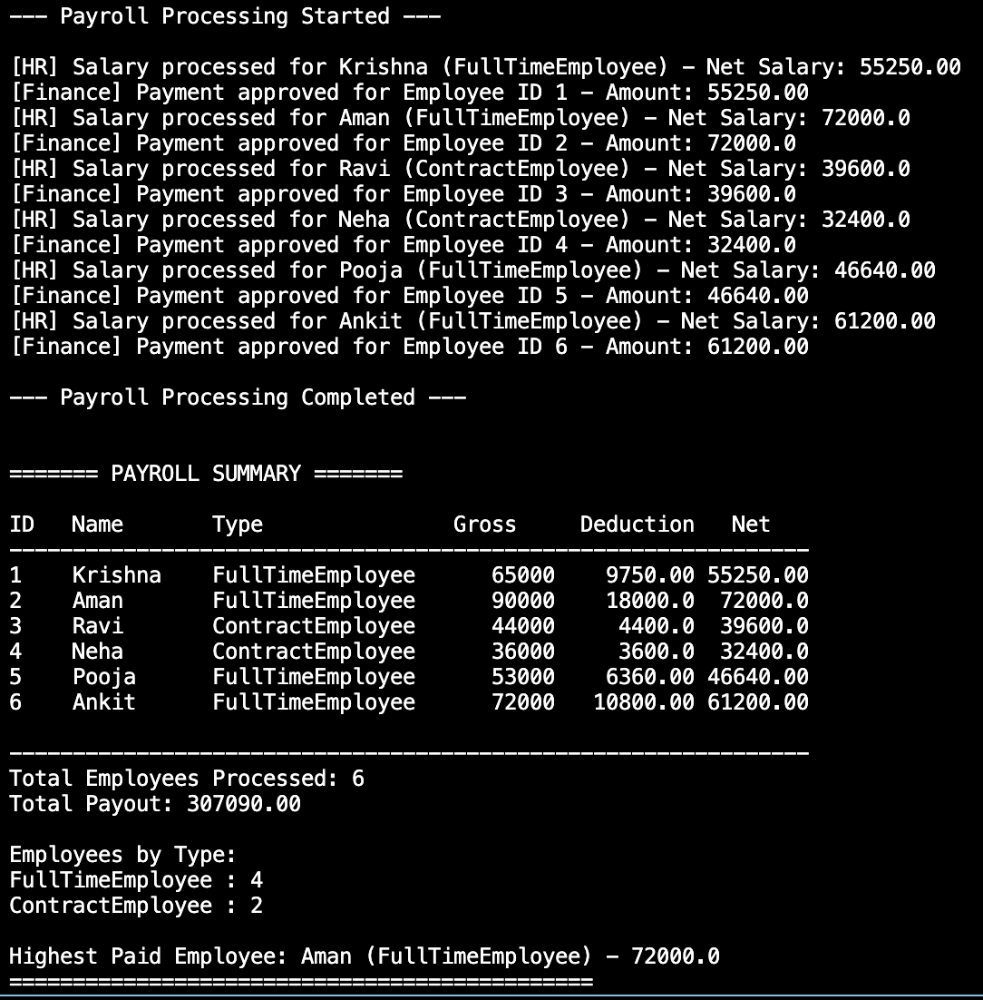

# 🧾 Payroll & Salary Processing System
(OOPS + Generics + Delegates in C#)

This project is a console-based Payroll & Salary Processing System developed in C# as part of a practical assignment to demonstrate Object-Oriented Programming, Generic Collections, and Delegates.

It simulates how a real company calculates employee salaries, applies deductions, and notifies HR & Finance teams after payroll processing.


### 📝 🚀 Features
- Supports Full-Time and Contract employees
- Uses Inheritance & Polymorphism for salary calculation
- Uses Generic Collections for in-memory data storage
- Uses Multicast Delegates for HR & Finance notifications
- Generates per-employee payslips
- Prints a complete payroll summary report

### 🔧 Key Concepts Used
- Object-Oriented Programming (OOP)
- Abstraction & Inheritance
- Polymorphism
- Delegate Usage
- Collections (List<T>)
- Static Utility Class
- Menu-driven Console Interaction
- Input Validation

### Flow Chart



### 🚀 Future Enhancements

- Add persistent storage using files or a database
- Implement edit and delete functionality for employee and payroll records
- Add date-based filtering for monthly or yearly payroll reports
- Expose the system as an ASP.NET Web API
- Add unit tests for salary calculation, deductions, and notifications

---

## ▶️ How to Run the Projects

```bash
dotnet run
